# Django-Ecommerce

This project revolves around creating an E-commerce Website, a virtual platform where users can browse through a diverse range of products available for purchase. The website facilitates online shopping by integrating a user-friendly shopping cart feature, allowing customers to add selected items for eventual order confirmation. Developed utilizing Django, a Python web framework, the system streamlines the shopping experience, ensuring seamless navigation and efficient transaction processing for users.

1. Enter this repository into a folder on your computer
2. Download Python
3. Open terminal inside the folder.
4.  pip install -r requirements.txt in the terminal window to install all the requirements to run the app.
5. run the program with "python manage.py runserver" to start a localhost server.
6. The API is Activated and now you can use the API routes to give requests.
7. DB Browser for SQLite used to manage,product,Category,Order,Login,signup,Cart,Customer data.

ScreenShots of The Project:
1]Home Page:
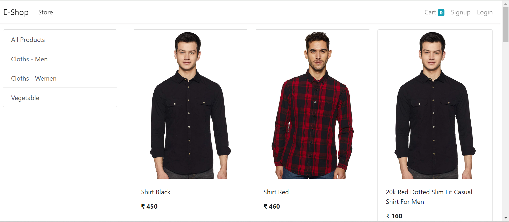

2]All Products:
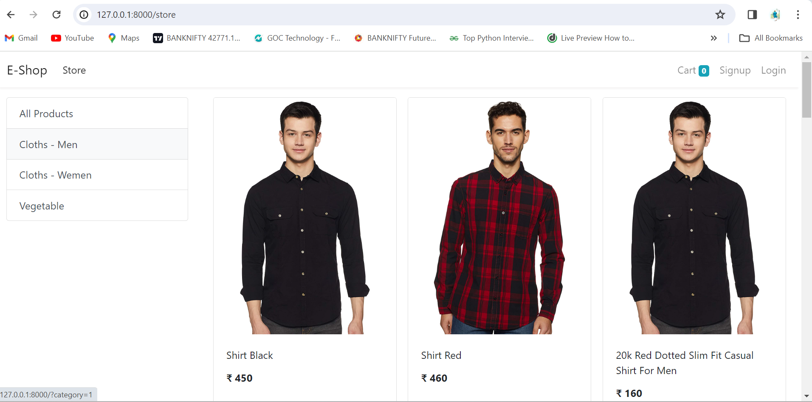

3]Cloths-Men:
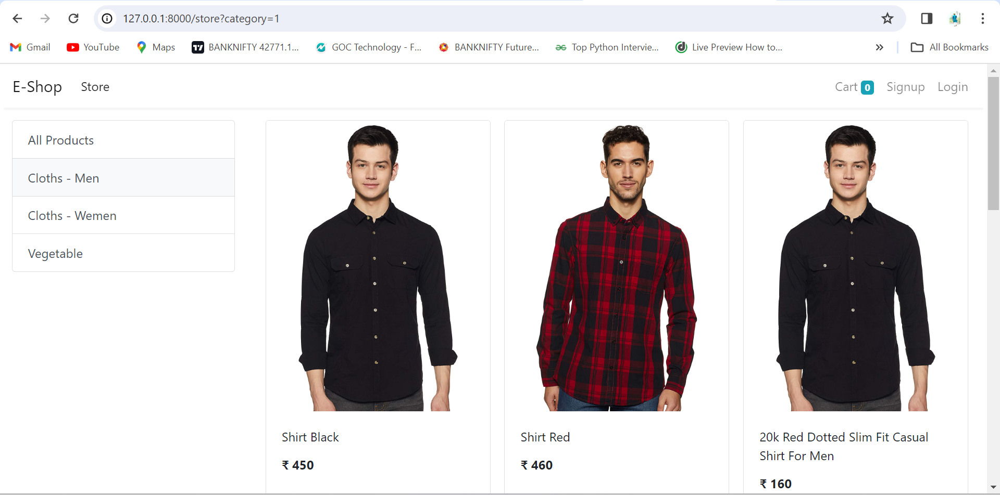

4]Cloths-Women:
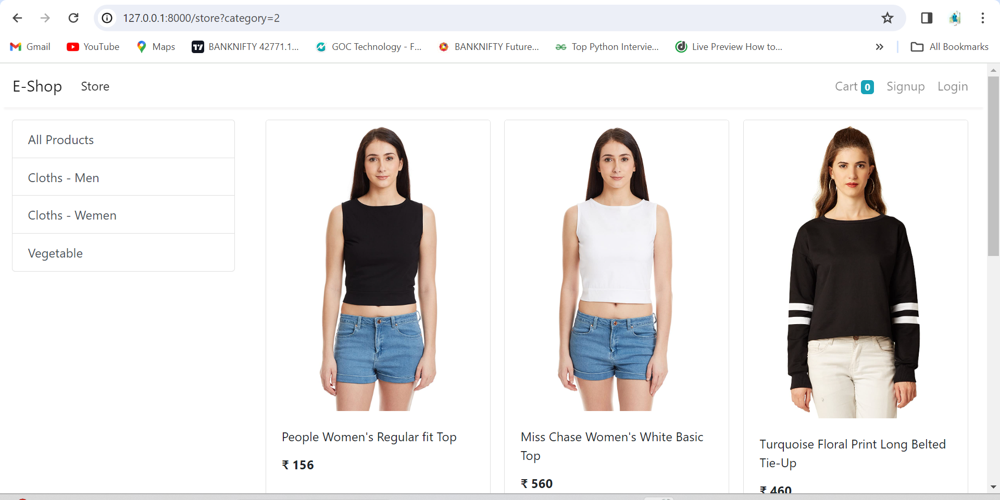

5]Vegetables:
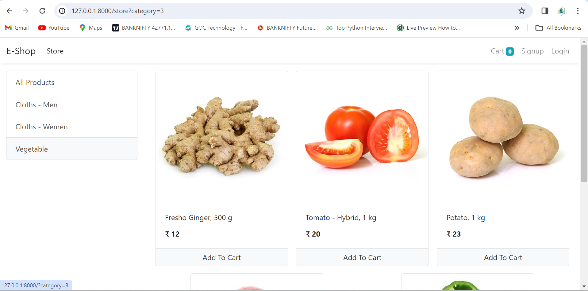

6]SignUp:
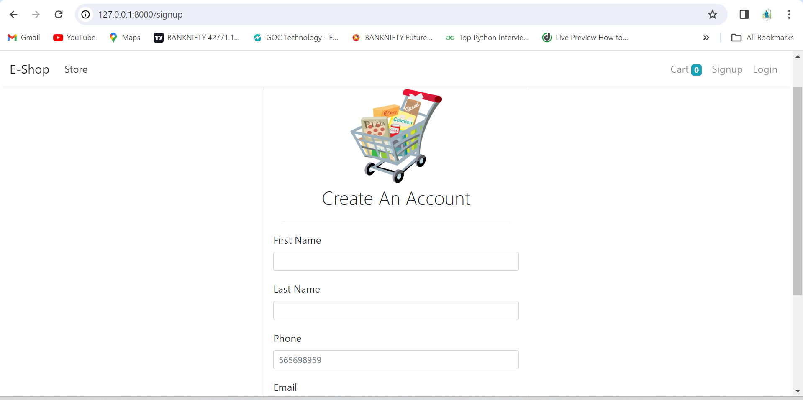

7]Login:
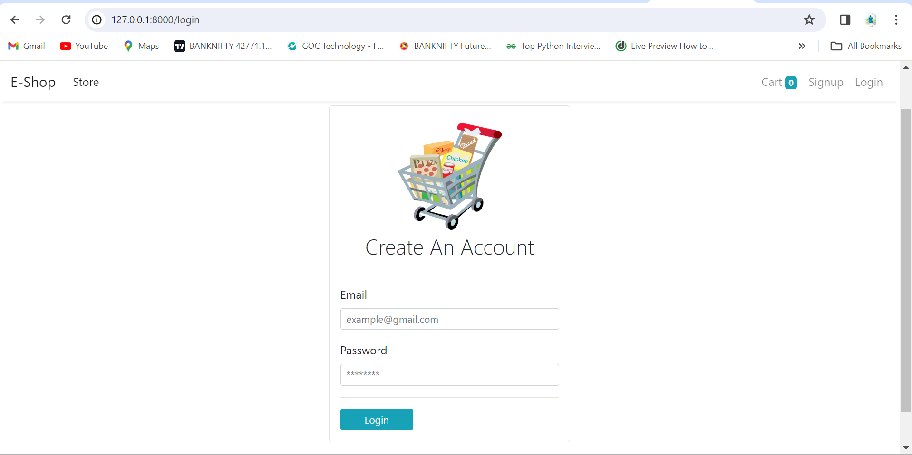

8]Cart:
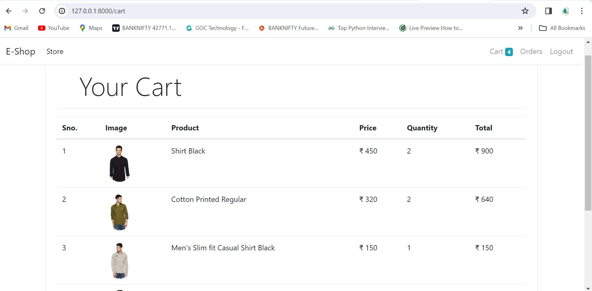

9]Orders:
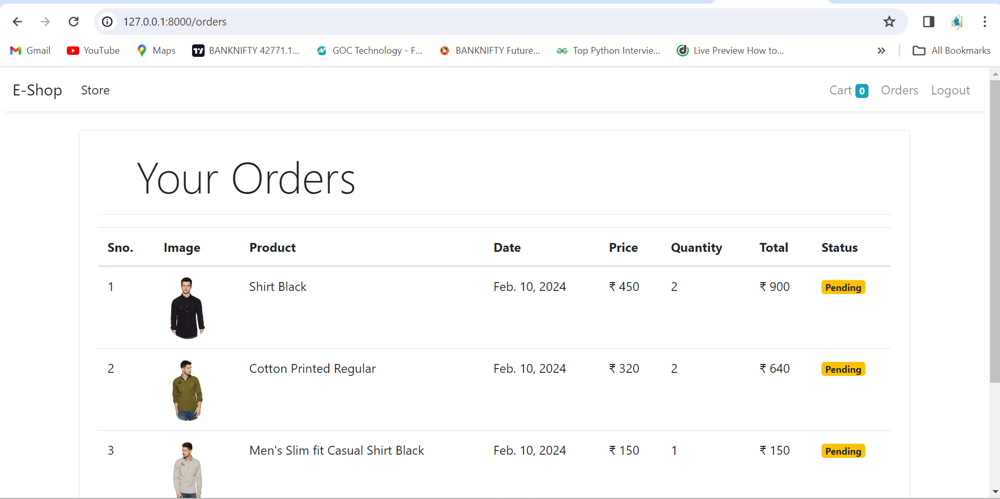

10]Database:

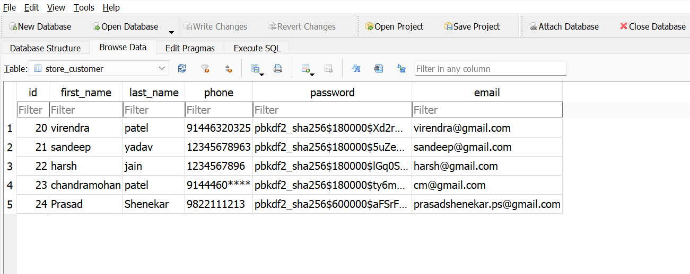
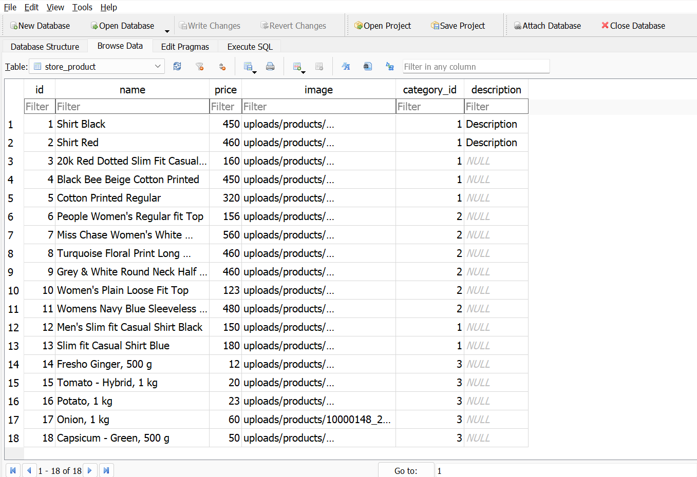
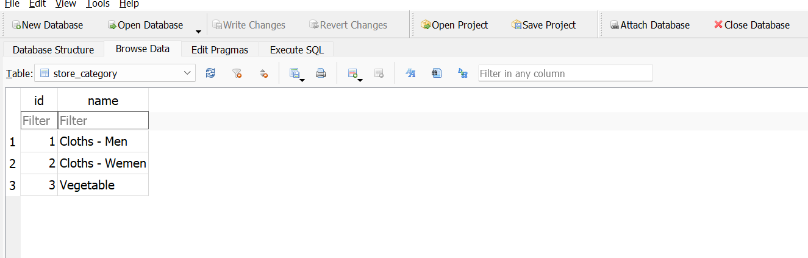

